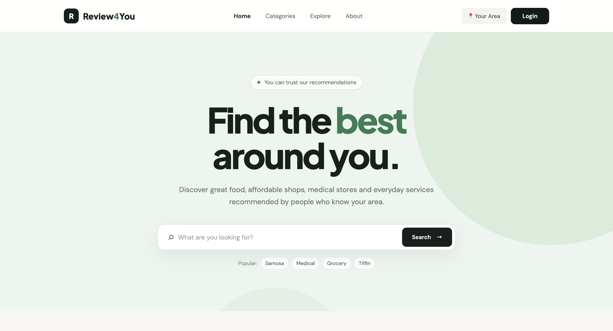
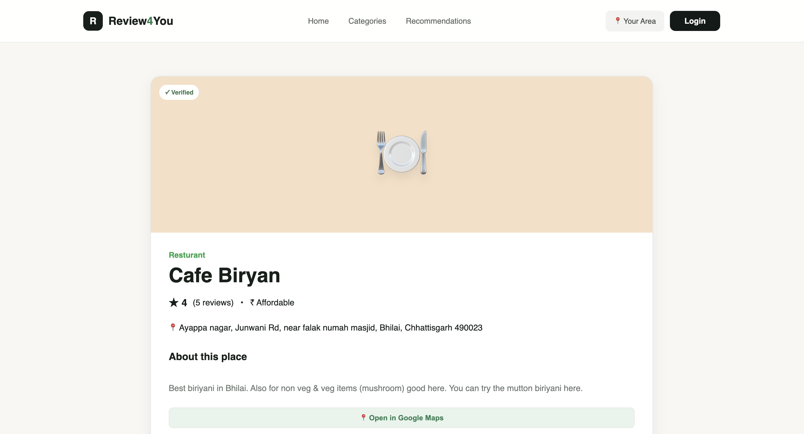
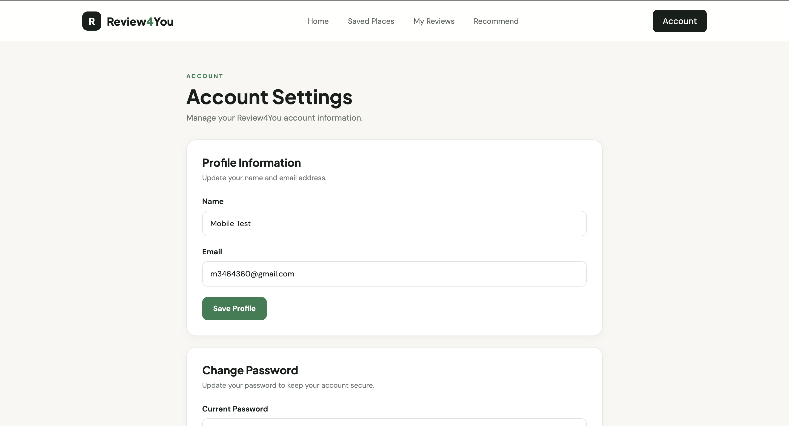

# Review4You

<p align="center">
  <strong>Discover better local places. Make better everyday choices.</strong>
</p>

<p align="center">
  A local review platform for discovering useful, affordable, and trusted places in your area.
</p>

<p align="center">
  
  
  
  
</p>

---

## 📖 About

**Review4You** is a local review web application designed to help people discover useful and affordable places in their area.

Users can explore places, view ratings and reviews, save their favorite places, and share their own experiences.

The goal of Review4You is to make everyday local decisions easier through useful place information and community reviews.

---

## ✨ Features

### 🔎 Place Discovery

- Search for places
- Browse places by category
- View recommended places
- View detailed place information
- Sort places by rating, price, and recent updates

### ⭐ Reviews

- View place reviews
- Add a review
- Edit your own review
- Delete your own review
- Manage reviews through authenticated accounts

### ❤️ Saved Places

- Save favorite places
- Remove saved places
- View saved places from your account

### 👤 User Accounts

- User registration
- Login and logout
- Password reset
- Account management
- View personal reviews

### 📍 Location

- Detect user location
- Manually select a location
- Use location information for local discovery

### 🛠️ Administration

- Separate local admin dashboard
- Manage places
- Manage reviews
- Admin-only access controlled through Firebase Security Rules

---

## 🛠️ Tech Stack

| Technology | Purpose |
|---|---|
| HTML5 | Page structure |
| CSS3 | Styling and responsive design |
| JavaScript | Application logic and interactions |
| Firebase Authentication | User authentication |
| Firebase Firestore | Application data and reviews |
| Firebase Hosting | Web hosting |
| Git | Version control |
| GitHub | Source code and collaboration |

---

## 📂 Project Structure

```text
review4you/
│
├── index.html
├── 404.html
│
├── html/
│   ├── about.html
│   ├── account.html
│   ├── forgot-password.html
│   ├── login.html
│   ├── my-reviews.html
│   ├── place.html
│   ├── recommend.html
│   ├── reset-password.html
│   ├── saved-places.html
│   └── signup.html
│
├── js/
│   ├── auth.js
│   ├── data.js
│   ├── firebase-config.js
│   ├── location.js
│   ├── place.js
│   ├── recommend.js
│   ├── review.js
│   ├── saved-places.js
│   └── script.js
│
├── css/
│   └── style.css
│
├── firebase.json
├── firestore.rules
├── firestore.indexes.json
├── .firebaserc
├── .gitignore
└── README.md
```
---

## 🔐 Security

Review4You uses **Firebase Authentication** and **Firestore Security Rules** to control access to application data.

User reviews are associated with authenticated users, allowing users to manage their own reviews.

Administrative functionality is separated from the public website and is not included in the public hosting deployment.

The Firebase Web API key is restricted to the project's authorized websites and APIs.

> Sensitive credentials, passwords, service-account keys, and private secrets should never be committed to the repository.

---

## 🎯 Project Goals

The main goals of Review4You are:

- Make local discovery easier
- Help users find affordable options
- Provide useful community reviews
- Make local information easier to access
- Give users a simple way to save and review places
- Create a simple and user-friendly local discovery experience

---

## 🔮 Future Improvements

Planned improvements include:

- [ ] Improve application performance
- [ ] Add more local places
- [ ] Improve filtering options
- [ ] Improve recommendation functionality
- [ ] Enhance mobile UI
- [ ] Add more place information
- [ ] Expand administrative functionality
- [ ] Improve accessibility
- [ ] Add additional features based on user feedback

---

## 👨‍💻 Author

**Ruddra**

GitHub: [@ruddra1518](https://github.com/ruddra1518)

---

## 🌐 Live Demo

🚀 **[Visit Review4You](https://review4you-26.web.app/)**

Try the live application and explore places, reviews, saved places, and user accounts.

---
## 📸 Screenshots

### 🏠 Home Page



### 📍 Place Details



### 👤 User Account



---

<p align="center">
  Made with ❤️ using HTML, CSS, JavaScript and Firebase
</p>
